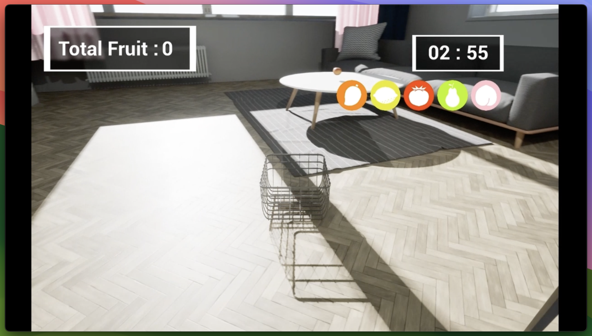
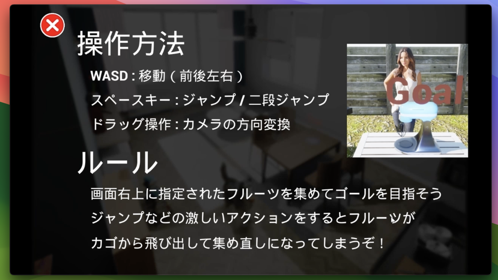

# FruitBasket

## ゲームの概要

プレイヤーはBasketを動かして、指定されたフルーツを集めよう

フルーツはフィールド上に転がっていたり、かくれたりしているので、
探して、集めて、ゴールまで運ぼう！！

## 遊び方

* 移動: WASDキーで移動
* ジャンプ: スペースキーでジャンプ (最大2段ジャンプ)

## 開発に関する情報

### 開発体制
* Unreal Engine 5を用いたチーム開発プロジェクト
* 担当箇所: Playerコントローラー
* `/Player`に担当したスクリプトを配置

### こだわり
プレイヤーに2段ジャンプ、ジャンプの大きさを調整させることで、難しさを表現

## プレイ動画

https://youtu.be/Ql0waKjpoRA

